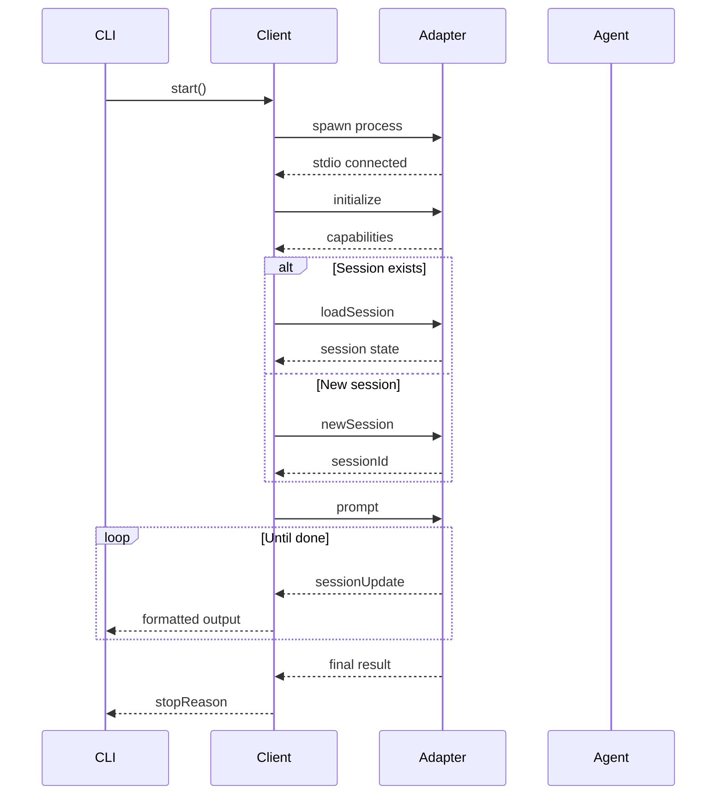
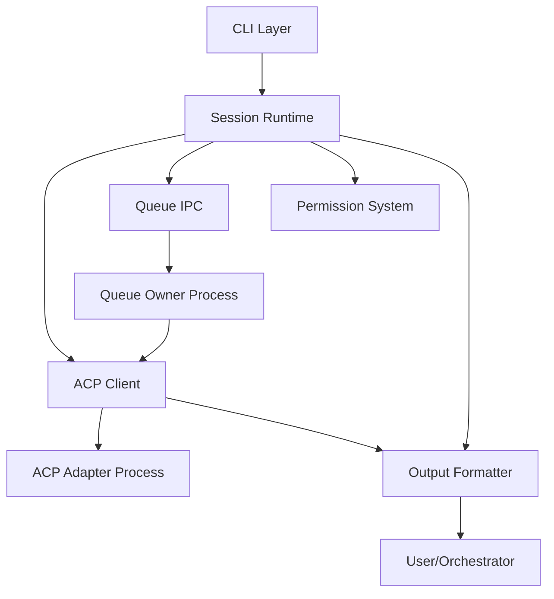

## Overview

`acpx` is a CLI client that speaks the Agent Client Protocol (ACP) over stdio. It provides a structured, non-interactive interface for orchestrators and coding agents to communicate with ACP-compliant adapters.

### Data Path

The high-level data flow is:

```
CLI command → AcpClient → ndjson/stdio → ACP adapter → coding agent
```

The CLI never scrapes terminal text from an interactive UI. It talks structured ACP JSON-RPC messages directly.

## Core Components

`acpx` is organized into several key modules, each with specific responsibilities:

### CLI Layer (`src/cli.ts`)

- Command grammar and flag parsing
- Output mode selection (text, JSON, quiet)
- Top-level command handling and routing
- User-facing error formatting

### ACP Client (`src/client.ts`)

- ACP transport and protocol methods
- Spawns the adapter process
- Connects with `ClientSideConnection` + `ndJsonStream`
- Handles `initialize`, `newSession`, `loadSession`, `prompt` methods
- Tracks agent lifecycle (PID, exit codes, signals)
- Manages permission callbacks

Key responsibilities:
- Protocol-level communication
- Process spawning and monitoring
- Permission request routing
- Session initialization and loading

### Session Runtime (`src/session-runtime.ts` + `src/session-runtime/`)

- Session persistence and resume/create logic
- Queue ownership and delegation
- Soft-close lifecycle management
- Timeout and interrupt handling
- Session cleanup
- Conversation model tracking

Key modules:
- `connect-load.ts`: Connection establishment and session load/fallback logic
- `lifecycle.ts`: Agent lifecycle snapshot application
- `prompt-runner.ts`: Direct prompt execution for control operations
- `queue-owner-process.ts`: Detached queue owner spawning

### Queue IPC System (`src/queue-ipc.ts`, `src/queue-ipc-server.ts`)

- Queue ownership lease management
- IPC protocol for prompt submission
- Unix domain socket communication
- Owner health probing
- Request/response protocol with generation tracking

### Permission System (`src/permissions.ts`)

- Permission policy enforcement (`approve-all`, `approve-reads`, `deny-all`)
- Interactive fallback for non-approved operations
- Permission statistics tracking (requested/approved/denied/cancelled)
- Non-interactive permission policy handling

### Output Formatting (`src/output.ts`)

- Streaming text/JSON/quiet output formatters
- ACP message rendering
- Error normalization and emission
- Context-aware session ID injection

## Protocol Flow

A typical prompt submission follows this sequence:



### Protocol Steps

1. **Initialize**: Advertises client capabilities (`fs.readTextFile`, `fs.writeTextFile`, `terminal`)
2. **Load or Create Session**:
   - If a saved session exists and agent supports `session/load`, attempt `loadSession`
   - If load fails with resource-not-found errors, fall back to `newSession`
   - If agent doesn't support load, create new session directly
3. **Prompt**: Submit user prompt and stream responses
4. **Stream Updates**: Process `sessionUpdate` notifications through the active formatter

<Info>
The fallback from `loadSession` to `newSession` is automatic and transparent. If a desired mode was set, it's replayed on the fresh session.
</Info>

## Session Persistence

Session metadata is stored in `~/.acpx/sessions/*.json`. Each record includes:

| Field | Description |
|-------|-------------|
| `acpxRecordId` | Stable local record identifier |
| `acpSessionId` | ACP session ID used for protocol calls |
| `agentSessionId` | Optional inner harness session ID |
| `agentCommand` | Command used to spawn adapter |
| `cwd` | Working directory |
| `name` | Optional named session identifier |
| `createdAt`, `lastUsedAt` | Timestamps |
| `closedAt` | Soft-close timestamp (when applicable) |
| `closed` | Soft-close state flag |
| `pid` | Adapter process PID (when known) |
| `protocolVersion` | ACP protocol version from initialize |
| `agentCapabilities` | Capabilities snapshot |
| `messages` | Conversation history |
| `acpx` | acpx-specific state (mode preferences, etc.) |

### Session Identity

Acpx uses a three-layer identity model:

- **`acpxRecordId`**: Stable local record key, never changes for a given session file
- **`acpxSessionId`**: ACP session ID used for protocol calls, may change if session is recreated
- **`agentSessionId`**: Inner harness session ID (Codex/Claude/etc.), extracted from `_meta.agentSessionId` when available

<Note>
The `acpxSessionId` may diverge from `acpxRecordId` during fallback flows (e.g., when `loadSession` fails and `newSession` creates a fresh ACP session). The `agentSessionId` is optional and only present when the adapter exposes it.
</Note>

## Queue Owner Lifecycle

Prompt submission is queue-aware per persistent session:

1. One `acpx` process becomes the **queue owner** for the active session
2. Concurrent invocations submit prompt requests to the owner via local IPC
3. After queue drain, owner waits up to idle TTL (`--ttl`, default 300s) for new work
4. TTL expiry shuts down owner, releases socket/lock, and clears queue-owner record
5. `sessions close`/`sessions new` soft-close and terminate related processes without deleting session JSON

### Owner Process Model

The queue owner runs as a **detached background process** with these characteristics:

- **One owner per active session**: Enforces single-writer concurrency
- **Long-lived**: Survives beyond individual CLI invocations
- **IPC endpoint**: Accepts queue/control requests via Unix domain socket
- **Heartbeat tracking**: Regularly updates lease with timestamp and queue depth
- **Crash recovery**: Stale owners are detected and reclaimed automatically

See [Session Lifecycle](/advanced/session-lifecycle) and [Queue IPC Protocol](/advanced/queue-ipc) for details.

## Permission Handling

Permission requests arrive through ACP `requestPermission` callbacks. Modes:

- **`approve-all`**: Auto-approve first allow option
- **`approve-reads`**: Auto-approve read/search operations; prompt for writes
- **`deny-all`**: Reject when possible

`acpx` tracks permission statistics (requested/approved/denied/cancelled) and uses them for exit-code behavior and observability.

Non-interactive permission policy controls fallback behavior when user input is unavailable:

- `fail`: Reject the permission request
- `allow`: Auto-approve

## Error Handling Strategy

`acpx` provides a two-layer error contract for orchestrators:

1. **Stable acpx codes**: `NO_SESSION`, `TIMEOUT`, `PERMISSION_DENIED`, `PERMISSION_PROMPT_UNAVAILABLE`, `USAGE`, `RUNTIME`
2. **Raw ACP error details**: Preserved JSON-RPC code/message/data when source error is ACP-native

JSON mode emits structured error events with:
- `code`: Top-level acpx error code
- `detailCode`: Fine-grained diagnostic (e.g., `QUEUE_OWNER_CLOSED`, `AUTH_REQUIRED`)
- `origin`: Source classification (`cli`, `runtime`, `queue`, `acp`)
- `retryable`: Hint for orchestrator retry logic
- `acp`: Raw ACP error envelope (when applicable)

See [Error Handling](/advanced/error-handling) for the full strategy.

## Component Interaction Diagram



## Key Design Principles

1. **Structured Communication**: No terminal scraping, only JSON-RPC
2. **Session Persistence**: Resume conversational context by default
3. **Queue-Based Concurrency**: Single-writer model per session
4. **Crash-Safe**: Automatic recovery from stale locks and dead owners
5. **Orchestrator-Friendly**: Deterministic behavior, explicit timeouts, machine-readable errors
6. **Non-Blocking**: Caller processes exit immediately after turn completion
