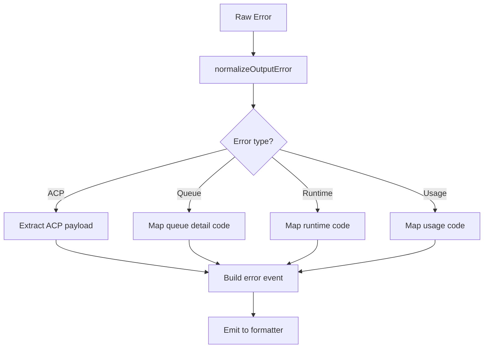

## Overview

`acpx` provides a permanent machine-facing error contract designed for orchestrators like OpenClaw. The error strategy preserves ACP semantics while providing stable codes for retry logic and diagnostics.

## Design Principles

1. **Keep ACP semantics intact** when available
2. **Provide stable `acpx` codes** for orchestrator logic
3. **Avoid parsing free-form message text**
4. **Keep text mode UX unchanged**
5. **Make changes additive** to preserve backward compatibility

## Two-Layer Error Contract

`acpx` exposes both:

1. **`acpx` machine codes**: Stable, small enum for orchestration decisions
2. **Raw ACP error details**: Numeric JSON-RPC code/message/data when source error is ACP-native

This dual-layer approach allows orchestrators to:
- Make high-level retry decisions based on `acpx` codes
- Perform fine-grained diagnostics using ACP error payloads
- Preserve full error context for debugging

## JSON Error Event Shape

In JSON mode, fatal failures emit structured error events:

```json
{
  "type": "error",
  "code": "NO_SESSION|TIMEOUT|PERMISSION_DENIED|PERMISSION_PROMPT_UNAVAILABLE|RUNTIME|USAGE",
  "detailCode": "AUTH_REQUIRED|QUEUE_PROTOCOL_INVALID_JSON|QUEUE_OWNER_CLOSED|...",
  "origin": "cli|runtime|queue|acp",
  "message": "Human-readable error description",
  "retryable": true,
  "sessionId": "sess-abc123",
  "requestId": "req-uuid",
  "timestamp": "2026-03-14T10:00:00.000Z",
  "acp": {
    "code": -32002,
    "message": "Resource not found: session xyz",
    "data": {}
  }
}
```

### Field Descriptions

| Field | Required | Description |
|-------|----------|-------------|
| `type` | Yes | Always `"error"` |
| `code` | Yes | Top-level `acpx` error code |
| `detailCode` | No | Fine-grained diagnostic code |
| `origin` | No | Source classification for debugging |
| `message` | Yes | Human-readable description |
| `retryable` | No | Hint for orchestrator retry policy |
| `sessionId` | No | Relevant session identifier |
| `requestId` | No | Queue request identifier |
| `timestamp` | No | Error occurrence timestamp |
| `acp` | No | Raw ACP/JSON-RPC error envelope |

<Info>
The `acp` field is included only when the underlying error originated from an ACP protocol response.
</Info>

## Top-Level acpx Codes

### `NO_SESSION`

Session is missing, invalid, or could not be loaded.

**Common causes**:
- Session file doesn't exist
- ACP resource-not-found error (`-32002`)
- Session corrupted or unreadable

**Retry recommendation**: Create new session

**Example**:
```json
{
  "code": "NO_SESSION",
  "detailCode": "SESSION_NOT_FOUND",
  "origin": "runtime",
  "message": "Session record not found: sess-abc123",
  "retryable": false
}
```

### `TIMEOUT`

Local timeout wrapper fired before operation completed.

**Common causes**:
- Agent process hung or extremely slow
- Network latency (for remote adapters)
- Prompt complexity exceeds timeout budget

**Retry recommendation**: Increase timeout or simplify prompt

**Example**:
```json
{
  "code": "TIMEOUT",
  "origin": "runtime",
  "message": "Operation timed out after 300000ms",
  "retryable": true
}
```

### `PERMISSION_DENIED`

Permission request was denied or cancelled by policy/user.

**Common causes**:
- User rejected interactive permission prompt
- Permission mode `deny-all` rejected operation
- Non-interactive policy `fail` rejected operation

**Retry recommendation**: Adjust permission policy or prompt user

**Example**:
```json
{
  "code": "PERMISSION_DENIED",
  "origin": "runtime",
  "message": "User denied permission request",
  "retryable": false
}
```

### `PERMISSION_PROMPT_UNAVAILABLE`

Non-interactive prompt policy is `fail` and prompt cannot be shown.

**Common causes**:
- Running in non-TTY environment
- Non-interactive permissions set to `fail`
- Permission required but no user available

**Retry recommendation**: Use `approve-all` or `approve-reads` mode

**Example**:
```json
{
  "code": "PERMISSION_PROMPT_UNAVAILABLE",
  "origin": "runtime",
  "message": "Cannot prompt for permission in non-interactive mode",
  "retryable": false
}
```

### `USAGE`

CLI or configuration invocation error.

**Common causes**:
- Invalid command-line arguments
- Missing required flags
- Invalid configuration file
- Agent command not found

**Retry recommendation**: Fix command-line invocation

**Example**:
```json
{
  "code": "USAGE",
  "origin": "cli",
  "message": "Invalid agent command: must not be empty",
  "retryable": false
}
```

### `RUNTIME`

All other runtime failures.

**Common causes**:
- Agent process crashed
- ACP protocol errors
- Queue IPC failures
- Unexpected exceptions

**Retry recommendation**: Depends on `detailCode` and `retryable` flag

**Example**:
```json
{
  "code": "RUNTIME",
  "detailCode": "AGENT_PROCESS_EXITED",
  "origin": "runtime",
  "message": "Agent process exited unexpectedly (code=1)",
  "retryable": true
}
```

## Detail Codes

Detail codes provide fine-grained diagnostics beyond top-level codes.

### Queue Detail Codes

| Code | Description |
|------|-------------|
| `QUEUE_OWNER_CLOSED` | Owner explicitly closed |
| `QUEUE_OWNER_SHUTTING_DOWN` | Owner is shutting down |
| `QUEUE_REQUEST_INVALID` | Malformed request envelope |
| `QUEUE_REQUEST_PAYLOAD_INVALID_JSON` | Invalid JSON in request |
| `QUEUE_ACK_MISSING` | Owner didn't send ACK |
| `QUEUE_DISCONNECTED_BEFORE_ACK` | Socket closed before ACK |
| `QUEUE_DISCONNECTED_BEFORE_COMPLETION` | Socket closed before result |
| `QUEUE_PROTOCOL_INVALID_JSON` | Invalid JSON in response |
| `QUEUE_PROTOCOL_MALFORMED_MESSAGE` | Malformed response message |
| `QUEUE_PROTOCOL_UNEXPECTED_RESPONSE` | Unexpected response type |
| `QUEUE_NOT_ACCEPTING_REQUESTS` | Owner alive but not responding |
| `QUEUE_OWNER_GENERATION_MISMATCH` | Generation mismatch |
| `QUEUE_RUNTIME_PROMPT_FAILED` | Prompt execution failed in owner |

### Runtime Detail Codes

| Code | Description |
|------|-------------|
| `AUTH_REQUIRED` | Adapter requires authentication |
| `SESSION_NOT_FOUND` | Session record doesn't exist |
| `SESSION_MODE_REPLAY_FAILED` | Failed to replay mode on fresh session |
| `AGENT_PROCESS_EXITED` | Agent process terminated unexpectedly |
| `CONNECTION_FAILED` | Failed to connect to adapter |
| `PROTOCOL_ERROR` | ACP protocol violation |

<Note>
The `AUTH_REQUIRED` detail code is the canonical way to detect authentication failures. The top-level code remains `RUNTIME` for backward compatibility.
</Note>

## Origin Classification

The `origin` field categorizes error sources:

| Origin | Description |
|--------|-------------|
| `cli` | Command-line invocation or argument parsing |
| `runtime` | Session runtime or execution layer |
| `queue` | Queue IPC protocol or owner communication |
| `acp` | ACP protocol or adapter response |

This helps route errors to the correct component for debugging.

## ACP Error Preservation

When an error originates from an ACP JSON-RPC response, the `acp` field preserves full details:

```json
{
  "code": "NO_SESSION",
  "message": "Session not found",
  "acp": {
    "code": -32002,
    "message": "Resource not found: session sess-abc123",
    "data": {
      "resource": "session",
      "id": "sess-abc123"
    }
  }
}
```

### ACP Compatibility Rules

1. **Resource-not-found**: ACP `-32002` maps to `NO_SESSION`
2. **Legacy fallback**: Some adapters use `-32001` or message patterns; `acpx` detects both
3. **Raw preservation**: Full ACP error always included in `acp` field when available

<Warning>
Do not rely on parsing `message` strings to detect error types. Use `code`, `detailCode`, and `acp.code` instead.
</Warning>

## Auth Required Handling

Authentication errors follow a special pattern:

```json
{
  "code": "RUNTIME",
  "detailCode": "AUTH_REQUIRED",
  "origin": "acp",
  "message": "Agent requires authentication",
  "retryable": false,
  "acp": {
    "code": -32000,
    "message": "Authentication required"
  }
}
```

**Orchestrator handling**:
1. Check `detailCode === "AUTH_REQUIRED"`
2. Prompt user for credentials or use stored auth
3. Retry with `authCredentials` option

## Cancellation Semantics

**Cancellation is not an error**. It's a normal completion path:

```json
{
  "type": "result",
  "result": {
    "stopReason": "cancelled",
    "sessionId": "sess-abc123"
  }
}
```

Queue `error` events should only be used for transport/protocol/runtime failures, not for user-initiated cancellation.

## Retry Logic Guidelines

Use `retryable` flag and `detailCode` to determine retry strategy:

```typescript
function shouldRetry(error: ErrorEvent): boolean {
  // Never retry usage errors
  if (error.code === 'USAGE') return false;
  
  // Never retry auth errors without new credentials
  if (error.detailCode === 'AUTH_REQUIRED') return false;
  
  // Always retry queue disconnects (stale owner)
  if (error.detailCode?.startsWith('QUEUE_DISCONNECTED')) return true;
  
  // Use retryable flag for others
  return error.retryable === true;
}
```

### Backoff Strategy

Recommended exponential backoff:

```typescript
const delays = [100, 500, 1000, 2000, 5000]; // ms
for (const delay of delays) {
  await sleep(delay);
  try {
    return await operation();
  } catch (error) {
    if (!shouldRetry(error)) throw error;
  }
}
```

## Output Already Emitted

Some errors occur after partial output has been streamed. The `outputAlreadyEmitted` flag indicates this:

```json
{
  "type": "error",
  "code": "RUNTIME",
  "message": "Agent disconnected during prompt",
  "outputAlreadyEmitted": true
}
```

This allows orchestrators to:
- Preserve partial output for user visibility
- Distinguish between clean failures and mid-stream errors
- Make smarter retry decisions

<Note>
When `outputAlreadyEmitted: true`, the output formatter may have already emitted the error via `onError()`. Queue error handlers should check `errorEmissionPolicy` to avoid duplicate error output.
</Note>

## Error Normalization Path

All errors flow through `src/error-normalization.ts`:



This ensures consistent error shape across all layers.

## Rollout and Compatibility

- Queue error parsing accepts both old (`message` only) and new (`code/detailCode/message`) payloads
- Text mode output and exit codes unchanged
- New JSON fields are additive
- `--json-strict` recommended for orchestrators needing JSON-only output

## Testing Requirements

### Unit Tests

- Normalization mapping matrix (ACP/native/runtime/queue/usage/permission/timeouts)
- Queue parse compatibility for old and new error payloads
- Detail code assignment for all error paths

### Integration Tests

- Queue disconnect/protocol failures emit typed `detailCode`
- No-session, timeout, permission paths emit structured error with expected `code`
- Cancel flow ends with `stopReason = "cancelled"` (not error)
- Auth-required flow emits `detailCode: "AUTH_REQUIRED"`

## Best Practices

<Note>
**For Orchestrators**: Always check `code` and `detailCode` for decision logic. Never parse `message` strings.
</Note>

<Note>
**For Retry Logic**: Use `retryable` flag as a hint, but implement domain-specific retry rules based on `detailCode`.
</Note>

<Note>
**For Debugging**: Include full `acp` payload in logs when available to preserve ACP protocol context.
</Note>
