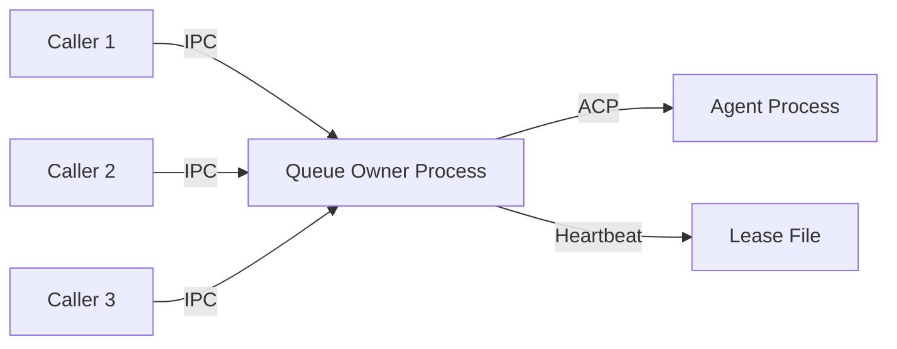
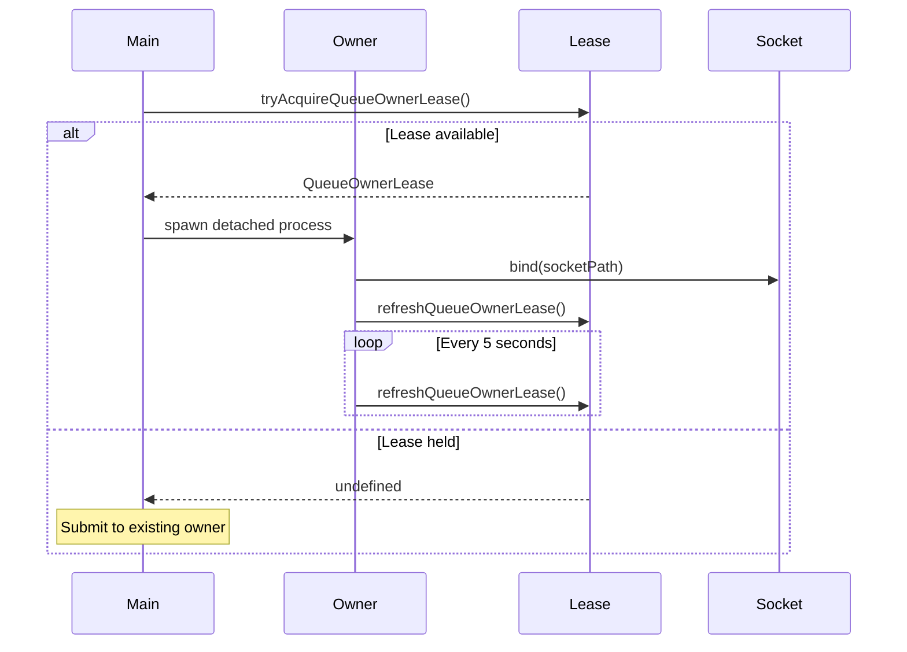
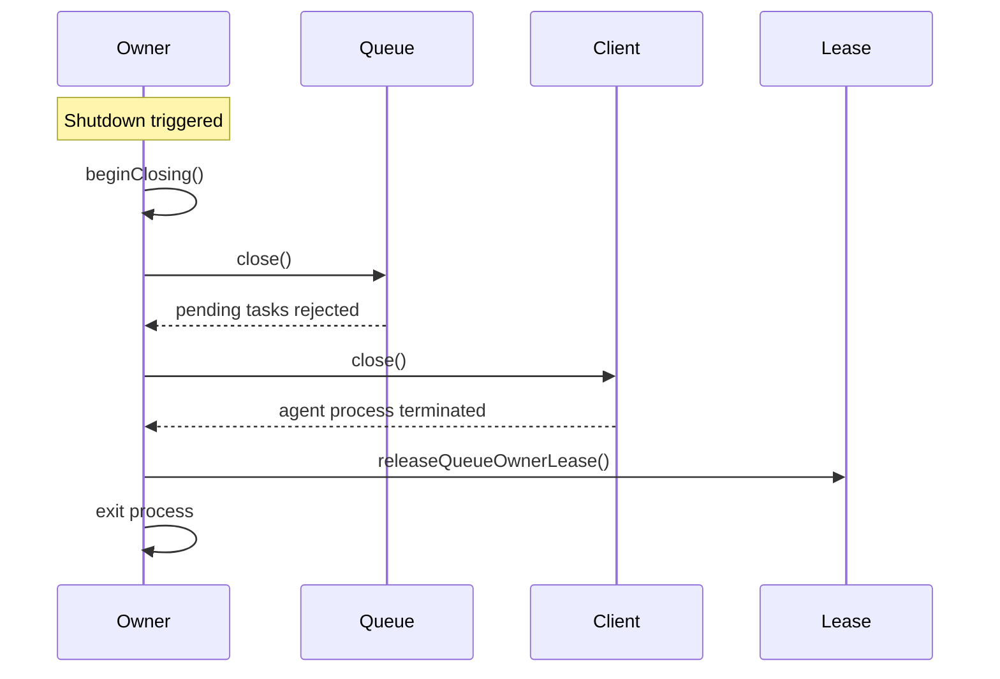
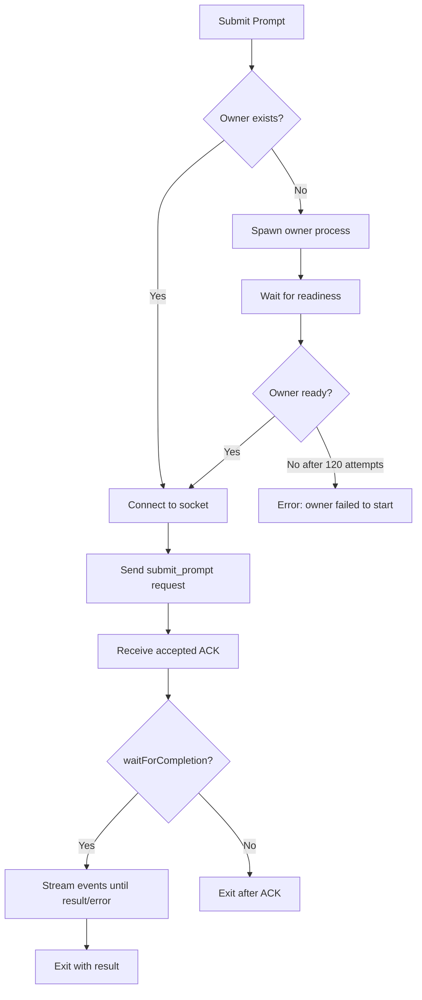

## Overview

The Queue IPC system enables concurrent `acpx` callers to submit prompts to a single warm session without spawning multiple agent processes. It uses a Unix domain socket protocol with a lease-based ownership model.

## Architecture

### Components



- **Queue Owner**: Detached background process that holds the ACP connection
- **Lease File**: `~/.acpx/queues/<sessionId>.lock.json` with owner metadata
- **IPC Socket**: Unix domain socket at `~/.acpx/queues/<sessionId>.sock`
- **Callers**: Foreground `acpx` processes that submit requests

### Process Topology

For one session:
- **At most one owner** daemon process
- **Many short-lived callers** submitting requests

For many sessions:
- **One owner daemon per active session**
- Independent lifecycle per owner (idle TTL, close, crash recovery)

## Queue Owner Lease

The lease is the single source of truth for ownership.

### Lease Record Format

```json
{
  "sessionId": "sess-abc123",
  "pid": 12345,
  "socketPath": "/home/user/.acpx/queues/sess-abc123.sock",
  "createdAt": "2026-03-14T10:00:00.000Z",
  "lastHeartbeatAt": "2026-03-14T10:05:32.123Z",
  "protocolVersion": 1,
  "ownerGeneration": 3,
  "queueDepth": 2
}
```

### Fields

| Field | Type | Description |
|-------|------|-------------|
| `sessionId` | string | ACP session identifier |
| `pid` | number | Owner process PID |
| `socketPath` | string | Absolute path to Unix domain socket |
| `createdAt` | string | ISO timestamp when lease acquired |
| `lastHeartbeatAt` | string | ISO timestamp of last heartbeat |
| `protocolVersion` | number | Queue protocol version |
| `ownerGeneration` | number | Increments on each owner spawn |
| `queueDepth` | number | Current number of queued requests |

### Owner Generation

The `ownerGeneration` field increments each time a new owner is spawned for a session. This prevents stale takeover races:

- Caller reads lease with generation N
- Caller sends request with `ownerGeneration: N`
- Owner validates generation matches current value
- If mismatch, owner rejects with `QUEUE_OWNER_GENERATION_MISMATCH`

## IPC Protocol

### Transport

All communication uses **newline-delimited JSON** over a Unix domain socket:

```
<JSON request>\n
<JSON response>\n
<JSON response>\n
...
```

Each message is a single JSON object terminated by `\n`.

### Request Types

#### Submit Prompt

```json
{
  "type": "submit_prompt",
  "requestId": "req-uuid",
  "ownerGeneration": 3,
  "message": "fix the bug in server.ts",
  "prompt": { /* PromptInput */ },
  "permissionMode": "approve-reads",
  "nonInteractivePermissions": "fail",
  "timeoutMs": 300000,
  "suppressSdkConsoleErrors": false,
  "waitForCompletion": true
}
```

#### Cancel Prompt

```json
{
  "type": "cancel_prompt",
  "requestId": "req-uuid",
  "ownerGeneration": 3
}
```

#### Set Mode

```json
{
  "type": "set_mode",
  "requestId": "req-uuid",
  "ownerGeneration": 3,
  "modeId": "architect",
  "timeoutMs": 10000
}
```

#### Set Config Option

```json
{
  "type": "set_config_option",
  "requestId": "req-uuid",
  "ownerGeneration": 3,
  "configId": "mode",
  "value": "architect",
  "timeoutMs": 10000
}
```

### Response Types

#### Accepted (ACK)

```json
{
  "type": "accepted",
  "requestId": "req-uuid",
  "ownerGeneration": 3
}
```

Sent immediately after request is queued.

#### Event (ACP Message)

```json
{
  "type": "event",
  "requestId": "req-uuid",
  "ownerGeneration": 3,
  "message": { /* AcpJsonRpcMessage */ }
}
```

Streamed for each ACP protocol message during prompt execution.

#### Result (Completion)

```json
{
  "type": "result",
  "requestId": "req-uuid",
  "ownerGeneration": 3,
  "result": {
    "stopReason": "end_turn",
    "sessionId": "sess-abc123",
    "permissionStats": { /* ... */ },
    "record": { /* SessionRecord */ },
    "resumed": true
  }
}
```

#### Error

```json
{
  "type": "error",
  "requestId": "req-uuid",
  "ownerGeneration": 3,
  "code": "RUNTIME",
  "detailCode": "QUEUE_RUNTIME_PROMPT_FAILED",
  "origin": "runtime",
  "message": "Agent process exited unexpectedly",
  "retryable": false,
  "acp": { /* optional ACP error payload */ },
  "outputAlreadyEmitted": true
}
```

#### Cancel Result

```json
{
  "type": "cancel_result",
  "requestId": "req-uuid",
  "ownerGeneration": 3,
  "cancelled": true
}
```

#### Set Mode Result

```json
{
  "type": "set_mode_result",
  "requestId": "req-uuid",
  "ownerGeneration": 3
}
```

#### Set Config Option Result

```json
{
  "type": "set_config_option_result",
  "requestId": "req-uuid",
  "ownerGeneration": 3,
  "response": { /* SetSessionConfigOptionResponse */ }
}
```

## Queue Owner Behavior

### Startup Sequence



### Event Loop

The owner runs a continuous event loop:

```typescript
while (true) {
  const task = await owner.nextTask(pollTimeoutMs);
  if (!task) {
    break; // Idle TTL expired
  }
  
  await runQueuedTask(sessionId, task, {
    sharedClient,  // Reused ACP client
    // ...
  });
}
```

### Task Execution

Each task runs in a **turn** with these steps:

1. **Begin turn**: Mark turn active, accept cancel requests
2. **Run prompt**: Execute via shared ACP client
3. **Stream output**: Forward ACP messages to caller via IPC
4. **Apply cancel**: If cancel requested, apply during prompt
5. **End turn**: Mark turn complete, send result/error
6. **Close task**: Release task resources

### Shared Client Reuse

The owner maintains a **single shared ACP client** across all tasks:

- Agent process spawned once on first task
- ACP session loaded/created once
- Subsequent tasks reuse warm connection
- Client closed only on owner shutdown

This provides **warm session reuse** without reconnection overhead.

### Idle TTL Policy

The owner uses configurable TTL behavior:

| TTL Value | Behavior |
|-----------|----------|
| `0` | Never expires (keep alive forever) |
| `> 0` | Exit after `ttlMs` milliseconds of inactivity |
| `undefined` | Use default 300,000ms (5 minutes) |

On first task, owner uses a minimum 1-second poll timeout to avoid immediate exit.

### Heartbeat Updates

Every 5 seconds, the owner refreshes the lease:

```typescript
setInterval(() => {
  refreshQueueOwnerLease(lease, {
    queueDepth: owner.queueDepth()
  });
}, QUEUE_OWNER_HEARTBEAT_INTERVAL_MS);
```

This updates `lastHeartbeatAt` and `queueDepth` for health probing.

### Shutdown Sequence



Shutdown occurs on:
- Idle TTL expiry
- Explicit `sessions close`
- Fatal unrecoverable errors
- SIGTERM/SIGINT signals

## Caller Workflow

When a caller wants to submit a prompt:



### Connection Retry

Callers retry socket connection up to 40 times with 50ms delays when:

- Socket file doesn't exist (`ENOENT`)
- Connection refused (`ECONNREFUSED`)

Other errors fail immediately.

### No-Wait Mode

When `waitForCompletion: false`:

1. Caller sends request
2. Caller receives `accepted` ACK
3. Caller exits immediately with `{ queued: true, requestId }`
4. Owner continues processing in background

<Note>
No-wait mode is useful for fire-and-forget workflows where the caller doesn't need to see prompt output.
</Note>

## Health Probing

Callers can probe owner health:

```typescript
const health = await probeQueueOwnerHealth(sessionId);
// Returns:
{
  sessionId: string,
  hasLease: boolean,
  healthy: boolean,          // Socket reachable
  socketReachable: boolean,
  pidAlive: boolean,
  pid?: number,
  socketPath?: string,
  ownerGeneration?: number,
  queueDepth?: number
}
```

This is used for diagnostics and status reporting.

## Error Handling

### Detail Codes

Queue-specific error detail codes:

| Code | Meaning |
|------|----------|
| `QUEUE_OWNER_CLOSED` | Owner explicitly closed |
| `QUEUE_OWNER_SHUTTING_DOWN` | Owner is shutting down |
| `QUEUE_REQUEST_INVALID` | Malformed request envelope |
| `QUEUE_REQUEST_PAYLOAD_INVALID_JSON` | Invalid JSON in request |
| `QUEUE_ACK_MISSING` | Owner didn't send ACK |
| `QUEUE_DISCONNECTED_BEFORE_ACK` | Socket closed before ACK |
| `QUEUE_DISCONNECTED_BEFORE_COMPLETION` | Socket closed before result |
| `QUEUE_PROTOCOL_INVALID_JSON` | Invalid JSON in response |
| `QUEUE_PROTOCOL_MALFORMED_MESSAGE` | Malformed response message |
| `QUEUE_PROTOCOL_UNEXPECTED_RESPONSE` | Unexpected response type |
| `QUEUE_NOT_ACCEPTING_REQUESTS` | Owner alive but not responding |
| `QUEUE_OWNER_GENERATION_MISMATCH` | Generation mismatch |

### Stale Owner Recovery

When a caller receives `QUEUE_PROTOCOL_MALFORMED_MESSAGE` or `QUEUE_PROTOCOL_UNEXPECTED_RESPONSE`, it triggers automatic recovery:

```typescript
await terminateQueueOwnerForSession(sessionId);
incrementPerfCounter('queue.owner.stale_recovered');
// Caller retries with fresh owner spawn
```

This ensures protocol compatibility and cleans up corrupted owner state.

## Concurrency Model

### Single-Writer Guarantee

The queue IPC system enforces **single-writer concurrency**:

- Only one owner per session
- Owner serializes all prompt submissions
- Atomic lease acquisition prevents split-brain

### Queue Depth Limiting

Owners reject new requests when queue depth exceeds `maxQueueDepth` (default 16):

```json
{
  "type": "error",
  "code": "RUNTIME",
  "detailCode": "QUEUE_FULL",
  "message": "Queue depth limit exceeded"
}
```

This provides backpressure to prevent unbounded queuing.

## Performance Considerations

### Warm Session Benefits

- **No process spawn overhead**: Agent process runs continuously
- **No ACP initialization cost**: Connection reused across prompts
- **No session load cost**: Session state kept in memory

Typical warm prompt latency: **50-200ms** (vs 1-3 seconds for cold start)

### IPC Overhead

Queue IPC adds minimal overhead:

- Socket connection: ~5-20ms
- Request serialization: ~1ms
- Per-event forwarding: ~0.1ms

Total overhead for typical prompt: **less than 50ms**

### Heartbeat Cost

Heartbeat updates every 5 seconds:

- Write lease JSON file: ~1-2ms
- Negligible CPU/memory impact

## Best Practices

<Note>
**For High-Throughput Workloads**: Use named sessions with long TTL to maximize warm session reuse.
</Note>

<Note>
**For Reliability**: Let `acpx` handle stale owner recovery automatically. Avoid manual lease manipulation.
</Note>

<Note>
**For Observability**: Monitor `queue.owner.stale_recovered` counter to detect protocol or process issues.
</Note>
