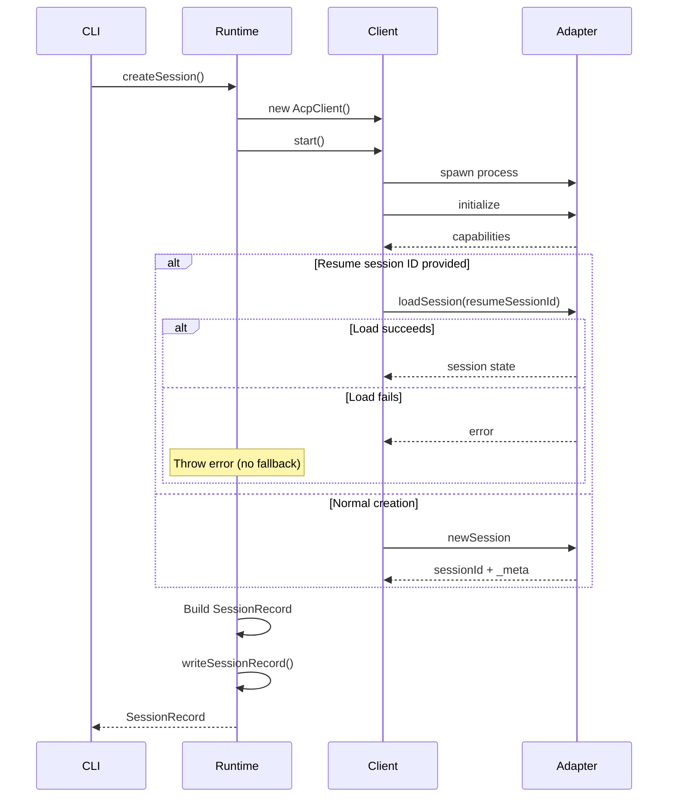
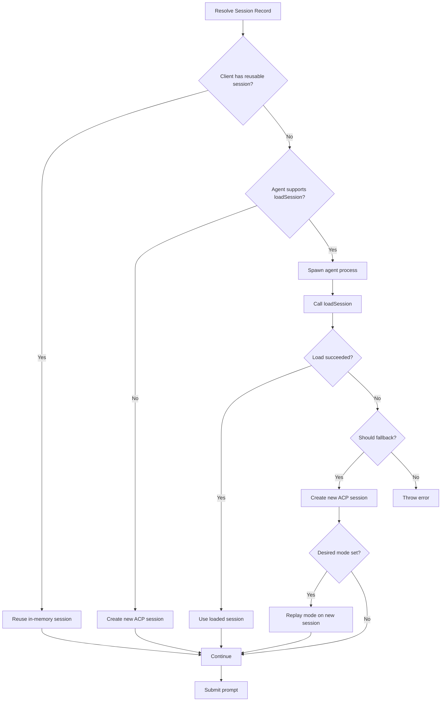
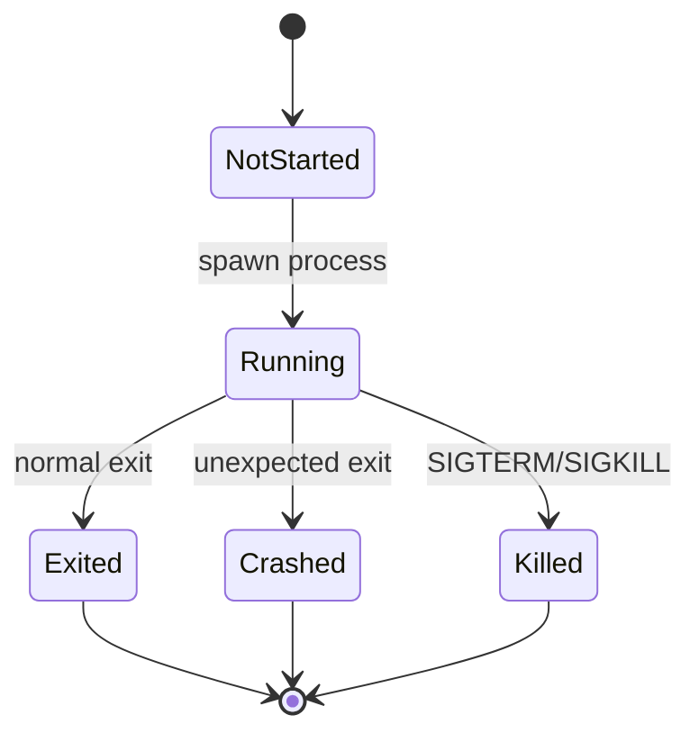
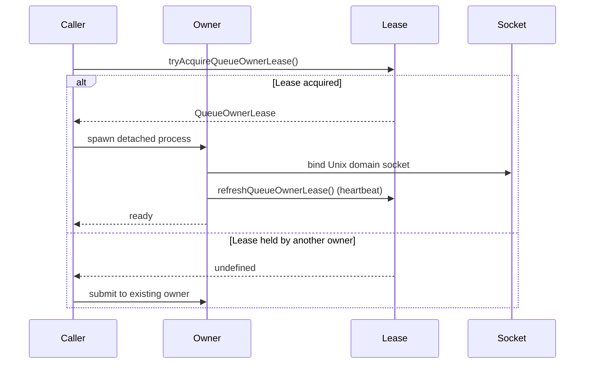

## Session States

A session in `acpx` can exist in one of several states throughout its lifecycle:

| State | Description |
|-------|-------------|
| **Non-existent** | No session record exists |
| **Active** | Session has `closed=false`, available for prompts |
| **Soft-closed** | Session has `closed=true`, excluded from auto-resume but record persists |
| **Orphaned** | Session record exists but agent process is dead |
| **Warm** | Queue owner is running with active ACP connection |

## Creating a New Session

When you run `acpx <agent> sessions new`, the following sequence occurs:



### Session Record Creation

The session record is initialized with:

```typescript
{
  schema: SESSION_RECORD_SCHEMA,
  acpxRecordId: sessionId,        // Stable record ID
  acpSessionId: sessionId,         // ACP session ID
  agentSessionId: normalized,      // From _meta.agentSessionId
  agentCommand: options.agentCommand,
  cwd: absolutePath(options.cwd),
  name: normalizeName(options.name),
  createdAt: now,
  lastUsedAt: now,
  closed: false,
  pid: lifecycle.pid,              // Agent process PID
  protocolVersion: client.initializeResult?.protocolVersion,
  agentCapabilities: client.initializeResult?.agentCapabilities,
  // ... conversation and state fields
}
```

<Info>
The `agentSessionId` is extracted from the adapter's `_meta.agentSessionId` field and may be undefined if the adapter doesn't expose it.
</Info>

## Resuming Sessions

When you submit a prompt to an existing session, `acpx` attempts to resume the ACP session state:

### Resume Decision Flow



### Load Fallback Conditions

The runtime falls back from `loadSession` to `newSession` when:

1. **ACP resource-not-found error** (`-32002`)
2. **Session has no agent messages yet** AND:
   - Query closed before response error
   - ACP internal error (`-32603`)

<Note>
Timeout and interrupt errors do NOT trigger fallback—they bubble immediately.
</Note>

### Mode Replay

When a fresh session is created after load failure, if the record has a `desiredModeId` in `record.acpx`, `acpx` replays the mode:

```typescript
if (createdFreshSession && desiredModeId) {
  await client.setSessionMode(sessionId, desiredModeId);
}
```

If mode replay fails, the operation throws `SessionModeReplayError` and the record is reverted to the original session ID.

## Session Identity Reconciliation

During resume flows, session identity may diverge:

### Identity Scenarios

| Scenario | `acpxRecordId` | `acpSessionId` | `agentSessionId` |
|----------|----------------|----------------|------------------|
| First creation | `sess-123` | `sess-123` | `codex-abc` (if exposed) |
| Successful load | `sess-123` | `sess-123` | Updated from load response |
| Load fallback | `sess-123` | `sess-456` (new) | Updated from newSession |
| Reconnect (PID alive) | `sess-123` | `sess-123` | Unchanged |
| Reconnect (PID dead) | `sess-123` | May change | May change |

### Agent Session ID Reconciliation

`agentSessionId` is updated from adapter responses during:

- `newSession` response `_meta`
- `loadSession` response `_meta`

If the adapter returns a non-empty, non-`"null"` string value, it's normalized and stored. Otherwise, the existing value is preserved.

## Process Lifecycle

### Agent Process States



The session runtime tracks agent lifecycle snapshots:

```typescript
type AgentLifecycleSnapshot = {
  pid?: number;
  startedAt?: string;
  lastExit?: {
    exitCode?: number;
    signal?: string;
    exitedAt: string;
    reason: 'normal' | 'unexpected' | 'killed';
    unexpectedDuringPrompt?: boolean;
  };
};
```

This snapshot is applied to the session record during:
- Connection establishment
- Prompt completion
- Error handling
- Interrupt handling

### PID Liveness Checks

`acpx` uses `isProcessAlive(pid)` to check if a stored PID is still running. On Linux, it sends `kill(pid, 0)` to test process existence without sending a signal.

Additionally, when closing sessions, `acpx` validates that the PID matches the expected agent command by reading `/proc/{pid}/cmdline` to avoid terminating unrelated processes.

## Queue Owner Lifecycle

The queue owner is a detached process that manages prompt submission for a session. See [Queue IPC Protocol](/advanced/queue-ipc) for the full protocol.

### Owner Spawn and Initialization



### Owner Heartbeat

While running, the owner refreshes its lease every 5 seconds with:

- `lastHeartbeatAt` timestamp
- `queueDepth` (number of pending requests)

This allows callers to detect stale owners and perform takeover.

### Owner Shutdown

The owner exits when:

1. **Idle TTL expiry**: No tasks received within `ttlMs` (default 300s)
2. **Explicit close**: `acpx <agent> sessions close` terminates owner
3. **Fatal error**: Unrecoverable runtime errors
4. **Process signal**: SIGTERM/SIGINT for graceful shutdown

On shutdown, the owner:
- Flushes and closes IPC socket
- Releases queue owner lease
- Persists final agent lifecycle snapshot

## Crash Recovery

When an owner crashes or becomes unreachable, `acpx` automatically recovers:

### Stale Owner Detection

```typescript
// Caller detects stale owner by:
1. Reading queue owner record
2. Checking PID liveness
3. Attempting socket connection
4. Validating heartbeat timestamp
5. Verifying owner generation
```

If any check fails, the caller can:

1. Terminate the stale owner PID (if alive but unresponsive)
2. Release the stale lease
3. Spawn a new owner
4. Retry the request

### Protocol Mismatch Recovery

If a caller receives a malformed response from an owner (detail codes `QUEUE_PROTOCOL_MALFORMED_MESSAGE` or `QUEUE_PROTOCOL_UNEXPECTED_RESPONSE`), it triggers stale owner recovery:

```typescript
await terminateQueueOwnerForSession(sessionId);
incrementPerfCounter('queue.owner.stale_recovered');
```

This ensures that owners with incompatible protocol versions or corrupted state are replaced.

## Soft Close

When you run `acpx <agent> sessions close`, the session is soft-closed:

```typescript
record.pid = undefined;
record.closed = true;
record.closedAt = isoNow();
await writeSessionRecord(record);
```

- The session record remains on disk
- Queue owner is terminated
- Agent process is killed (if PID matches expected command)
- Auto-resume lookup skips soft-closed sessions
- Session can be explicitly resumed by ID

<Warning>
Soft-closed sessions are excluded from `sessions ensure` auto-discovery. To resume a soft-closed session, you must explicitly reference it by ID or name.
</Warning>

## Session Ensure

The `sessions ensure` operation provides idempotent session acquisition:

```typescript
1. Walk directory tree from cwd to boundary (git root or explicit boundary)
2. Look for existing session matching (agentCommand, cwd, name)
3. If found, return existing session
4. Otherwise, create new session
```

This ensures that:
- Multiple tools can share a session without coordination
- Sessions are naturally scoped to project directories
- No duplicate sessions are created for the same context

## Best Practices

<Note>
**For Long-Running Sessions**: Use named sessions and explicit `sessions ensure` to avoid creating duplicate sessions across tool invocations.
</Note>

<Note>
**For Crash Recovery**: Let `acpx` handle stale owner recovery automatically. Avoid manual PID management.
</Note>

<Note>
**For Mode Persistence**: Use `session/set_mode` or `session/set_config_option mode=<modeId>` to persist mode preference across session recreations.
</Note>
